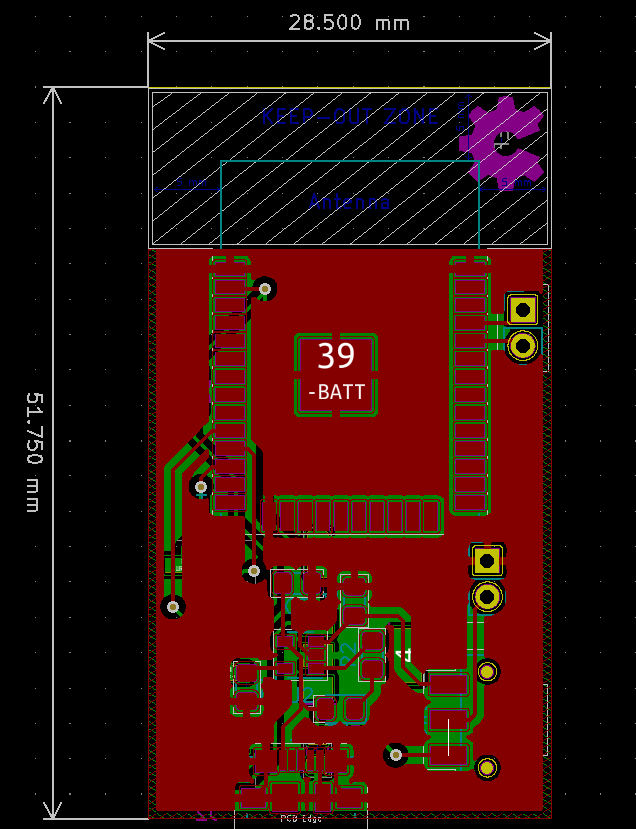
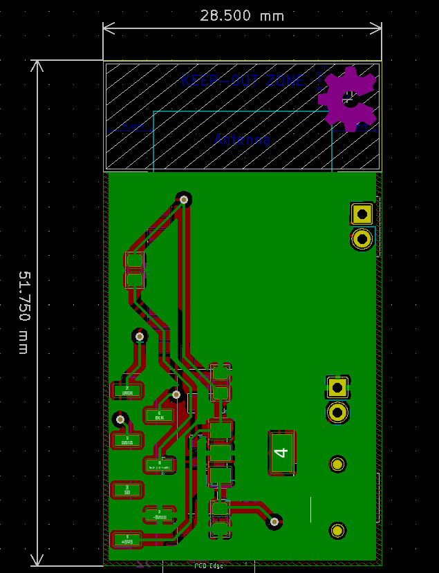
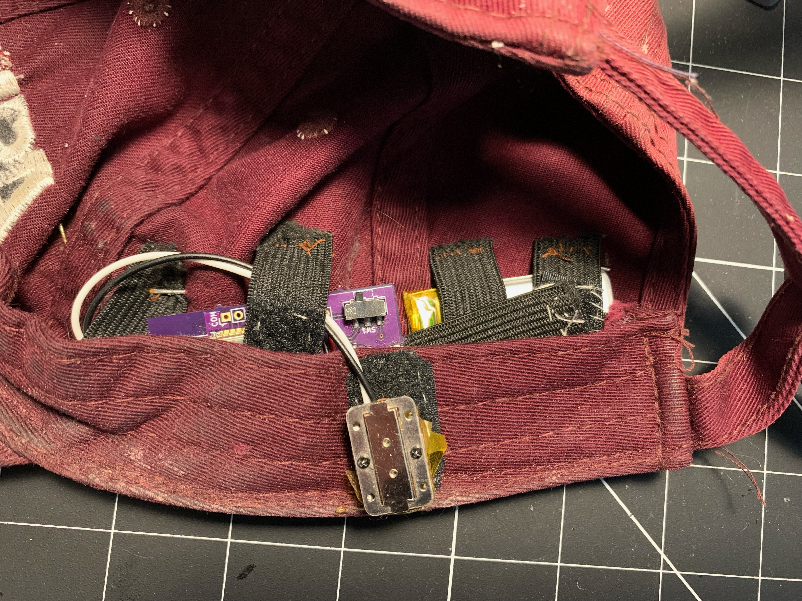

# BrainFM

A wireless bone conduction headset based on the ESP32, designed to fit inside of a hat. Powered by an ESP32 and an off the shelf DAC with built-in amplifier (MAX98357).
## PCB Images

  
  

## Physical Build

  

